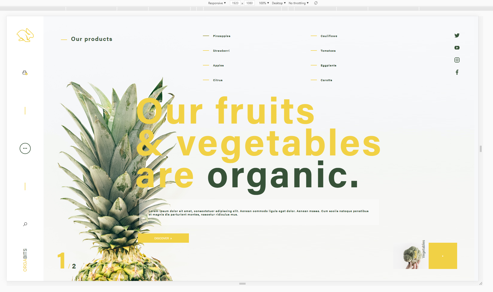

[](https://github.com/RexT2507/Integration-Web-Tp-Note/actions/workflows/angular.yml)

# IntegrationWebTpNote

This project was generated with [Angular CLI](https://github.com/angular/angular-cli) version 11.2.8.

## Guide d'utilisation du projet

```diff
- ATTENTION BIEN LIRE LES INTRUCTIONS
```

Quand vous vous rendrez sur le projet pensez à mettre le navigateur en responsive et dans les dimentions `1920x1080` et mettre la souris en mode `Desktop`.



## Development server

Run `ng serve` for a dev server. Navigate to `http://localhost:4200/`. The app will automatically reload if you change any of the source files.

# Guide du développement du projet

| Action dans le projet |    Étiquette    |
| :---------------      |:---------------:|
| Ajout                 |      [ADD]      |
| Supprimer             |      [DEL]      |
| Développement         |      [DEV]      |
| Correction            |      [FIX]      |
| Mise à jour de branche|      [MAJ]      |
